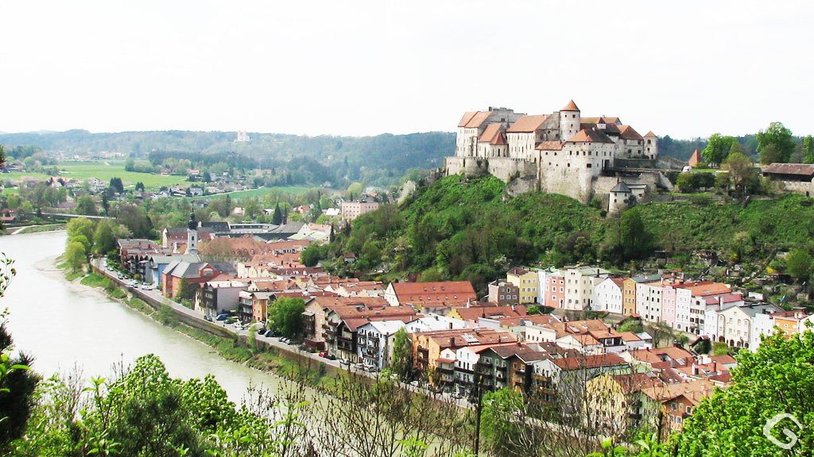

## Origin of Attack of titan

Attack on titan is a English translation of the bestselling manga Shingeki no Kyojin by [Hajime Isayama](https://twitter.com/hajime_isayama?lang=en) which first appeared in 2009.

The plot depicts a near extinct human race devoured by thoughtless cannibalistic giants, hints at a vast conspiracy, and feats of heroism that only occasionally break the unrelenting sense of imminent doom. This series is clearly a modern epic fantasy.

The story revolves around Eren Yeager and his comrades, who battle these mindless titans. This manga explores the viscreal reality of death which is unlike any other anime/manga. Titan are the physical personification of death, walking reminders of human mortality. But the darkest elements of the series are not the titans (and their lack of genitals 😉) but the structure of the society behind the walls.

## Relational to German Ideology

  
  

The show is set in an quasi-germanic society which is full of german architecture. The characters too have German names. Even the opening sequence is in German.

<!-- <iframe src=http://mp3anime.tk/embed/162 allow="autoplay" scrolling=no width=400 height=120 frameborder=0></iframe> -->

<!-- <audio ref='themeSong' src="https://raw.githubusercontent.com/batra98/Gaurav-Website/master/content/posts/Attack-on-Titan-and-German-Philosophy/theme.mp3" autoPlay loop></audio> -->

<audio controls="controls">
  <source type="audio/mp3" src="https://raw.githubusercontent.com/batra98/Gaurav-Website/master/content/posts/Attack-on-Titan-and-German-Philosophy/theme.mp3"></source>
  
Your browser does not support the audio element.

</audio>

This doesnot end the show's similarities with German history.
The political ideology of the society lines up with a famous Nazi philosopher - [Carl Schmitt](https://en.wikipedia.org/wiki/Carl_Schmitt)

The three ideas central to Schmitt's ideology discussed in the `The Political` are as follows:

### Conflict and Inequality

According to Schnmitt: Conflict, Division and Inequality are basic characteristic of a human society as humans are by nature hellish and savage. People are essentially full of shit and life is not fair.

The show focuses on this fact theme and all the characters have to fight in order to survive. Acoording to Schmitt, we are all monsters at heart and conflict, inequality is unavoidable. According to him, if society has to function properly then it doesnot make sense to attempt to eleminate inequality because it will always exist

In attack on titan, we see this first hand, as classes are separated by literal walls. Each wall section is its own caste system. We also observe this inequality in military structure where the survey corps venture outside the walls into danger, whereas the MPs drink their time away within the walls. According to Schmitt, getting rid of problems like inequality is a distraction from more important things like nationalism and survival.

### Friends and Enemies

The second element of `The Political` is: a clear distinction between friend and enemies. The main idea is - good governments need an enemy to struggle against. Without a clear enemy, human nature drives a war against all, an unending civil war where the eradication of one's own people becomes an eventuality. The existence of a clear enemy (in this case the titans) impedes the quest for constant war and infighting. When they first break through the wall, the Titans appear to Eren—and therefore to us—as the incarnations of absolute evil.

Both Commander Pyxis and Erwin Smith worry that the Titans are not the real enemies, that they are not the real threat, the real threat is humanity itself. The titans merely keep people in line, they give everyone a common enemy.

When the humans discover that Titans are in fact actual humans, it blurs the boundary between friends and enemies, and thus it makes the task of mainting peace difficult for the government.

### Sovereighty

The final element of Schmitt's `The Political` is the power of the sovereighty itself. The soverighty has the power to declare a state of emergency and sacrifice some of the human lives for the greater good of the populace. We see a similar theme in Attack on Titan, when the scouts go out to reclaim wall Maria and other instances where people are killed by the MPs to conceal the identity of the Fritz Family.

When accepting the fact that conflict is an inevitable part of human nature, one is left with two possibilities: surrender and die, or fight and live. In Attack on Titan, these two options are represented respectively by the characters of Zeke and Eren.

Unwilling to kill innocent people, Zeke intends to gain control over the king's abilities and use them to sterilize all members of his race. Once the Eldians will have died out, the world shall be left to the Marleyans, who can thenceforth live on in peace. His "euthanization plan", as Isayama calls it, bears a striking resemblance to the position adopted by Indian pacifist Mahatma Ghandi, who maintained in one interview that the only moral answer to Nazi Germany's Final Solution was for the European Jewry to commit collective suicide.

Eren, using a different moral compass, finds Zeke's plan reprehensible. Recognizing that both the Marleyans and the Eldians essentially fight for the same goal, he sees no evil in fighting fire with fire if it means securing the future of his race. After betraying his brother to come into possession of the king's powers, Eren uses them to create an army of colossal titans with the intention to commit what is more or less the story's equivalent of nuclear holocaust. Convinced that the war will not end until one side has completely annihilated the other, he commands his monsters to destroy all life on earth outside the walls.

