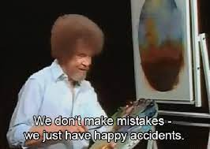

This new year, I decided to record my interview prearation journey and hopefully it will help someone like me in the future. So here goes nothing.

## Rubrik Interview

### System Coding Round (Date - 10/01/2022)

<details>
<summary><b>System Coding Round Prepartation Journey</b></summary>

- This round will mainly focus on concurrency and multithreading concepts.
- I have negligible knowledge on these topics. But, I like the challenge
- I have exactly 1 week for preparations, so let's try to make the most of it.

[03/01/2022]

- Awesome post on medium to get started on things: [Rubrik Interview Experience](https://abhinav-prakash.medium.com/rubrik-india-sde-2-interview-experience-72477c72ec8).

- Found a Youtube Playlist: [Bo Quian's Cpp Playlist](https://www.youtube.com/watch?v=LL8wkskDlbs&list=PL5jc9xFGsL8E12so1wlMS0r0hTQoJL74M)
- Things learned from the playlist:

  - How to create threads.
  - Achieve syncronization using locks and mutexes.
  - Conditional variables (avoid busy waiting).
  - Future and Options
  - Async functions
  - Packaged Task

- Got basic understanding of concepts. Tommorrow will move on to more practical things.

[04/01/2022]

- Tried solving [Leetcode playlist](https://leetcode.com/problemset/concurrency/) on concurreny.
- Solved the following problems:

* [Complement Base 10](https://leetcode.com/problems/complement-of-base-10-integer/): Bit Manuplation

    <details>
    <summary>Cpp Implementation</summary>

    ```cpp

    class Solution {
    public:
        int bitwiseComplement(int n) {

            int x = 1;
            while(x<n)
                x = x*2+1;
            return x^n;

        }
    };

    ```

    </details>

- [Print in order](https://leetcode.com/problems/print-in-order/): Synchronisation using [condition_variable](https://en.cppreference.com/w/cpp/thread/condition_variable) and [mutexes](https://en.cppreference.com/w/cpp/thread/unique_lock).

    <details>
    <summary>Cpp Implementation</summary>

    ```cpp

    class Foo {
        public:

            int count = 0;
            mutex mu;
            condition_variable c;


            Foo() {

                count = 1;

            }

            void first(function<void()> printFirst) {


                unique_lock lck(mu);
                count++;
                // printFirst() outputs "first". Do not change or remove this line.
                printFirst();

                lck.unlock();
                c.notify_all();
            }

            void second(function<void()> printSecond) {


                unique_lock lck(mu);
                while(count != 2)
                {
                    c.wait(lck);
                }

                count++;
                // printSecond() outputs "second". Do not change or remove this line.
                printSecond();


                lck.unlock();
                c.notify_all();
            }

            void third(function<void()> printThird) {

                unique_lock lck(mu);
                while(count != 3)
                {
                    c.wait(lck);
                }


                // printThird() outputs "third". Do not change or remove this line.
                printThird();
                lck.unlock();
            }

        };

    ```
    </details>

- [Print FooBar](https://leetcode.com/problems/print-foobar-alternately/): Synchronisation using [condition_variable](https://en.cppreference.com/w/cpp/thread/condition_variable) and [mutexes](https://en.cppreference.com/w/cpp/thread/unique_lock).

    <details>
        <summary>Cpp Implementation</summary>

    ```cpp

    class FooBar {
    private:
        int n;

    public:
        mutex mu;
        condition_variable c;
        bool is_foo = true;
        FooBar(int n) {
            this->n = n;
        }

        void foo(function<void()> printFoo) {

            for (int i = 0; i < n; i++) {

                unique_lock lck(mu);

                while(!is_foo)
                {
                    c.wait(lck);
                }
                is_foo = false;
            // printFoo() outputs "foo". Do not change or remove this line.
            printFoo();

                lck.unlock();
                c.notify_all();
            }
        }

        void bar(function<void()> printBar) {

            for (int i = 0; i < n; i++) {

                unique_lock lck(mu);

                while(is_foo)
                {
                    c.wait(lck);
                }
                is_foo = true;
            // printBar() outputs "bar". Do not change or remove this line.
            printBar();
                lck.unlock();
                c.notify_all();

            }

        }
    };

    ```

  </details>


- Started the [Back to Basics: Cpp Concurrency](https://www.youtube.com/watch?v=riUCrKQ_ezc).
- I could not spend more time today, but will try to spend more time tommorrow.

[05/01/2022 - 06/01/2022]

- I have been chilling a lot. Haven't even completed the previous video.
- Need to devote more time to this.

[07/01/2022-08/01/2022]

- Completed the video series.
- Solved a couple of problems on Leetcode and Lintcode. Some of them are as below:

* [Building H20](https://leetcode.com/problems/building-h2o/)

  <details>
    <summary>Cpp Implementation</summary>

  ```cpp

    class H2O {
    public:

        mutex mu;

        condition_variable c;
        int num_hyd;
        int num_oxy;
        int count;

        H2O() {
            num_hyd = 0;
            num_oxy = 0;

        }

        void hydrogen(function<void()> releaseHydrogen) {

            unique_lock<mutex> lck(mu);

            while(num_oxy*2 < num_hyd)
            {
                c.wait(lck);
            }
            // releaseHydrogen() outputs "H". Do not change or remove this line.
            // cout << "H\n";

            releaseHydrogen();
            num_hyd++;

            lck.unlock();
            c.notify_all();
        }

        void oxygen(function<void()> releaseOxygen) {

            unique_lock<mutex> lck(mu);

            while(num_oxy*2 > num_hyd)
            {
                c.wait(lck);
            }
            // releaseOxygen() outputs "O". Do not change or remove this line.
            // cout << "O\n";
            releaseOxygen();
            num_oxy++;

            lck.unlock();
            c.notify_all();
        }
    };

  ```

  </details>

* [Dining Philosophers](https://leetcode.com/problems/the-dining-philosophers/)

    <details>
        <summary>Cpp Implementation</summary>
    
    ```cpp

        class DiningPhilosophers {
        public:


            mutex mu;
            condition_variable c;
            vector<bool> fork;

            DiningPhilosophers() {

                for(int i=0;i<5;i++)
                    fork.push_back(true);

            }

            void wantsToEat(int philosopher,
                            function<void()> pickLeftFork,
                            function<void()> pickRightFork,
                            function<void()> eat,
                            function<void()> putLeftFork,
                            function<void()> putRightFork) {


                {
                    unique_lock lck(mu);

                    while(fork[philosopher%5] == false && fork[(philosopher+1)%5] == false)
                    {
                        c.wait(lck);
                    }

                    fork[philosopher%5] = false;
                    fork[(philosopher+1)%5] = false;


                    pickLeftFork();
                    pickRightFork();
                    eat();
                    putLeftFork();
                    putRightFork();

                    fork[philosopher%5] = true;
                    fork[(philosopher+1)%5] = true;

                    lck.unlock();
                    c.notify_all();
                }


            }
        };

  ```
  </details>
  

- Lintcode has a lot of interesting problems, will some more tommorrow.
- Also, remember to give the OA for Schrodinger.

[10/01/2022]
- The interview went good. The interviewer was a nice person. Enjoyed the interview a lot.

[11/01/2022]
- Got a mail for a second round of interviews 🎉🎉🎉.
- Will start a new thread on that soon. 

<p align="center">

</p>


</details>


### System Coding Round - II (Date - 19/01/2022)

<details>
<summary><b> System Coding Round - II Preparation Journey </b></summary>

- This round will be similar to the last round.
- Focus will be on multi-threading and concurrency.
- Need to brush up my skills more and gain more confidence on concepts.

[12/01/2022 - 13/01/2022]
- I did not do much as far as preparation is concerned, maybe I am too lazy 😂.
- But, Now I have a long weekend coming. Will make the most out of it.

[14/01/2022 - 16/01/2022]
- Watched the video series to refresh topics: [Multi-threading in C++](https://www.youtube.com/watch?v=eeSC43KQdVI&list=PL_dsdStdDXbrzGQUMh2sy6T8GcCCst3Nm)
- Solved a couple of good problems on Lintcode. Some of the good ones are:
    - [n threads print 1-m](https://www.lintcode.com/problem/2438/). 
    <details>
    <summary><b>Code Implementation</b></summary>

    ```cpp
    
    #include <iostream>
    #include <thread>
    #include <mutex>
    #include <condition_variable>

    using namespace std;

    class Solution {
    private:
        int n;
        int m;
        

    public:
        mutex mu;
        condition_variable c;

        int count;
        Solution(int n, int m) {
            this->n = n;
            this->m = m;
            

            

            count = 0;
            // write your code
            
        }

        


        void printThreadNumber(void printNumber(int x, int id), int thread_id) {
            // write your code
            
            int extra=0;
            
            if(thread_id<m%n)
                extra++;

            for(int i=0;i<m/n+extra;i++)
            {
                unique_lock<mutex> lck(mu);

                while(count%n != thread_id)
                {
                    c.wait(lck);
                }
                // cout << count << '\n';
                printNumber(count+1,thread_id);
                count++;
                
                

                lck.unlock();
                c.notify_all();

                // num--;


            }

        }
    };


    ```


    </details>

    - [Sleep Sort](https://www.lintcode.com/problem/2449/)
    <details>
    <summary><b>Code Implementation</b></summary>

    ```cpp
    #include <iostream>
    #include <thread>
    #include <vector>
    #include <chrono>
    using namespace std;

    class Solution {
    public:
        void print_after_delay(void printNumber(double),double x)
        {
            int t = x*1000;
            std::this_thread::sleep_for(std::chrono::milliseconds(t));
            printNumber(x);
            
        }

        void sleepSort(int n, vector<double> nums, void printNumber(double)){
            // write your code
            vector<thread*> threads;
            for(int i=0;i<n;i++)
            {
                threads.push_back(new thread(&Solution::print_after_delay,this,printNumber,nums[i]));
            }

            for (int i = 0; i < n; i++) {
                threads[i]->join();
                delete threads[i];
            }   


        }
    };


    ```


    </details>


</details>

## Amazon Interview

### ~~Behavioural Interview Round~~ Technical Round [17/01/2022]
<details>
<summary><b>Behavioural Interview Round</b></summary>

- Got an OA from Amazon which was quite easy.
- Received an invite for Behavioural Interview.
- Planning to look at the links provided and some online stuff.

[17/01/2022]
- The interview turned out to be a technical interview 🥲.
- Two questions were asked.
- Was able to code the first one with the most optimal solution that they desired.
- In the second question, was not able to acheive the optimal time complexity which they wanted.
- Will now discuss the questions, my solutions and optimal solutions because:

<!--  -->

<p align="center">

</p>


</details>
