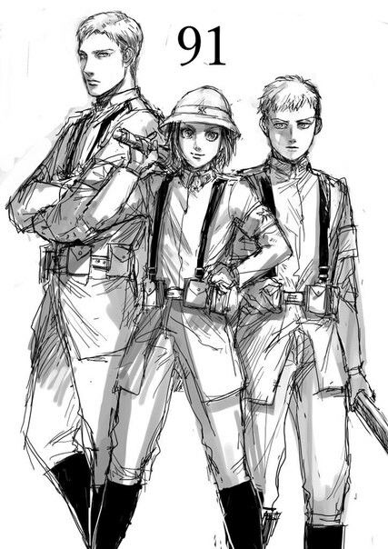

Attack on Titan Season 4 is here!! and what the heck is going on?

<audio controls="controls">
  <source type="audio/mp3" src="https://raw.githubusercontent.com/batra98/Gaurav-Website/master/content/posts/The-Other-Side-of-the-Sea/Season_4_opening.mp3"></source>
  
Your browser does not support the audio element.

</audio>

At the end of Season 3, the scouts defeated Zeke, Reiner and Berthlot at the battle of Shiganshina and discovered the truth about the world. Now, four years after that discovery we get to see what that world is really like.

We are introduced to new characters - Gabi, Falco and Colt, who are warrior candidates in the Empire of Marley. The Empire of Marley currently holds the Beast Titan (Zeke), Cart Titan (Pieke), Armoured Titan (Reiner) and Jaw Titan (Galliard, who definately has eaten Ymir at some point after she returned with Reiner).

Marley is also the home country of Grisha (father to Eren and Zeke) and it is the same nation that sent children (Reiner, Annie and Bertlot) to massacare their own people. In this episode, the audiences are exposed to the sheer amount of brain-washing and manipulation that the eldians in Marley go throughout their lives. It changes the way in which we see Annie, Reiner and Bertlot. They were not simply mass murderers seeking out blood rather they were brain-washed children, who were made to perform acts against humanity that will weigh on their souls for the rest of their lives.

We can see this clearly in Reiner's appearance. Colt is the next in line to inherit the Beast titan.

In the episode, we see that Marley has been fighting with the Allied Forces of Middle East. We see other nations have technology that can harm the titans (Even the Armoured Titan). We get to the devastating power of the Armoured, Beast and Jaw titans.

### Main Highlights of the Episode

#### Gabi Braun

She is a smart and cheeky girl, who has a lot of potential for growth.

	</img>
	
Spoiler Warning

	Do watch her out. She will do things that most of us will not like.

#### Beast Titan swirls rocks at a fleet, Armoured Titan smashes walls and takes out big guns. (The usual stuff 😉)

#### It's raining titans !!!

<audio controls="controls">
  <source type="audio/mp3" src="https://raw.githubusercontent.com/batra98/Gaurav-Website/master/content/posts/The-Other-Side-of-the-Sea/Raining-Men.mp3"></source>
  
Your browser does not support the audio element.

</audio>

